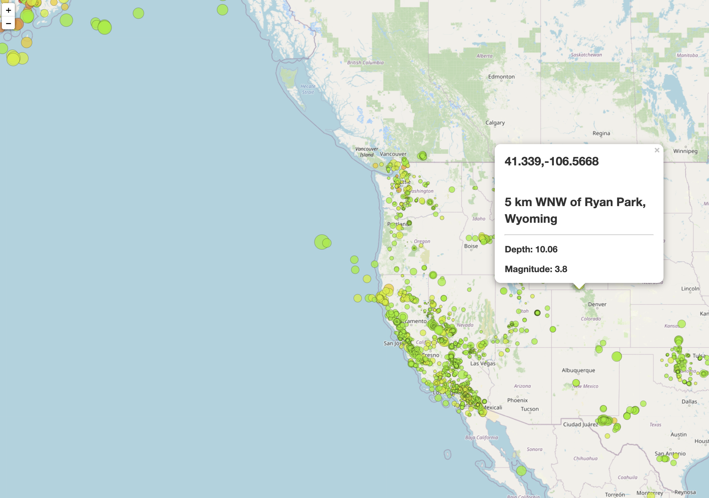

Visualize an earthquake data with Leaflet

 Basic Visualization

   

 Use the URL of this JSON to pull in the data for our visualization.

   

2. **Import & Visualize the Data**

   Create a map using Leaflet that plots all of the earthquakes from your data set based on their longitude and latitude.

 markers reflect the magnitude of the earthquake by their size and and depth of the earthquake by color. Earthquakes with higher magnitudes  appear larger and earthquakes with greater depth appear darker in color.

 
   I finally generate the map with popup for each marker

   

    and also with legend indicating the depth by the color scale

   

